# GaleMed Insights – A Gen-AI RAG-Based Medical Chatbot Using Pinecone and LLMs


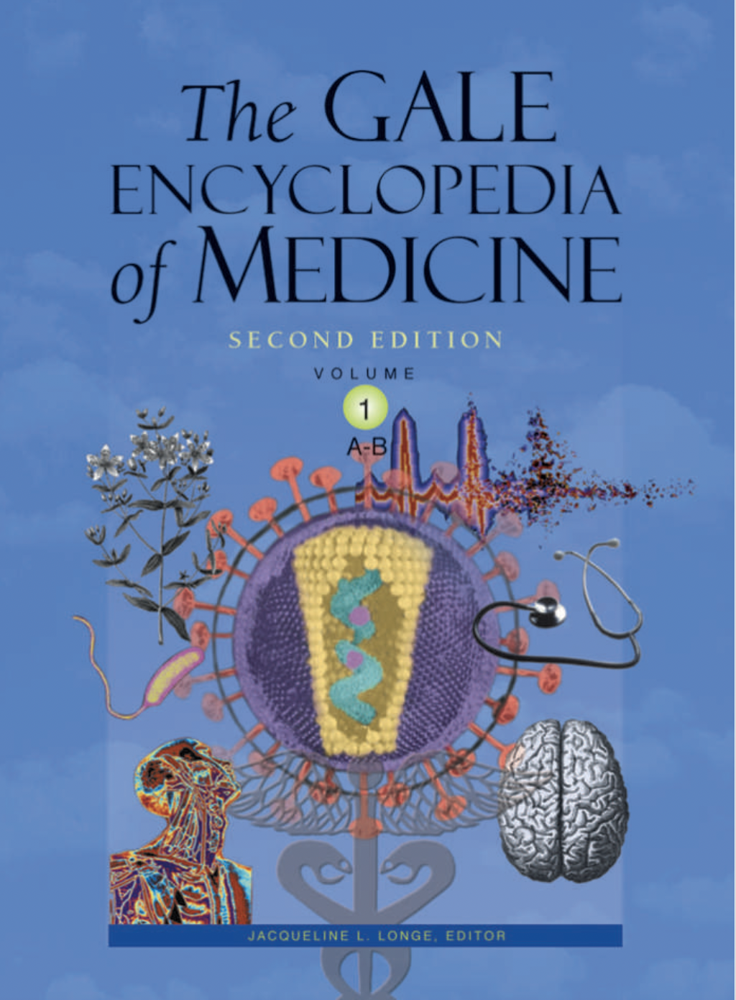

Credits: [The Gale Encylopedia of Medicine](https://www.academia.edu/32752835/The_GALE_ENCYCLOPEDIA_of_MEDICINE_SECOND_EDITION)


<a href="https://langchain.readthedocs.io/en/latest/">
    
</a>
<a href="https://www.groq.com/">
    
</a>
<a href="https://www.pinecone.io/">
    
</a>
<a href="https://huggingface.co/">
    
</a>
<a href="https://github.com/">
    
</a>
<a href="https://www.python.org/">
    
</a>
<a href="https://github.com/facebookresearch/llama">
    
</a>
<a href="https://huggingface.co/docs/transformers/model_doc/ctransformers">
    
</a>
<a href="https://pypdf.com/">
    
</a>

---
## Project Overview
**GaleMed Insights** is an advanced medical chatbot built using a Retrieval-Augmented Generation (RAG) framework, leveraging the wealth of medical knowledge contained in The Gale Encyclopedia of Medicine, which spans over 637 pages. By combining PDF processing, semantic embedding, and vector databases, GaleMed Insights offers accurate, detailed, and user-friendly responses to medical inquiries. This makes it a valuable and accessible resource for individuals seeking trustworthy health information.

With its foundation in The Gale Encyclopedia of Medicine, GaleMed Insights ensures users can access well-researched, vetted content on a wide range of medical topics, from conditions and treatments to best healthcare practices. The chatbot empowers users to easily navigate complex medical concepts and obtain clear, relevant answers.

Link for the book: [The Gale Encylopedia of Medicine](https://www.academia.edu/32752835/The_GALE_ENCYCLOPEDIA_of_MEDICINE_SECOND_EDITION)

---

## Why Use RAG-Based Methodology Instead of Just LLMs?
Using a Retrieval-Augmented Generation (RAG) methodology offers significant advantages over traditional large language models (LLMs) alone:

#### Higher Accuracy and Reliability:
GaleMed Insights retrieves factual information directly from The Gale Encyclopedia of Medicine, ensuring that responses are factually accurate and relevant. This drastically reduces the risk of generating incorrect information (known as "hallucinations"), which is a common issue when using LLMs on their own.

#### Targeted Knowledge Base:
Instead of relying on broad datasets, GaleMed Insights focuses on a specific medical knowledge base, ensuring that users receive expert, specialized responses. This contrasts with general LLMs, which may provide superficial or irrelevant answers to health-related queries.

#### Contextual Relevance:
Through chunking and semantic embedding, GaleMed Insights retrieves the most relevant information while maintaining the necessary context, which leads to clearer and more coherent responses tailored to the user's needs.

#### Efficient Memory Management:
Dividing the text into chunks avoids running into token limits of LLMs, allowing the model to process large documents effectively without losing important details from the encyclopedia.

#### Improved User Experience:
With precise, well-formatted responses, GaleMed Insights enhances the readability and accessibility of complex medical information, making it easier for users to understand and act on the information provided.

---
## Why This Project?
The GaleMed Insights project is designed to address the growing need for reliable, accurate, and accessible medical information. In a world where misinformation spreads easily, especially on health-related topics, GaleMed Insights offers a trusted source of knowledge from The Gale Encyclopedia of Medicine. Key reasons for developing this project include:

#### Improving Health Literacy:
GaleMed Insights empowers individuals to make informed decisions about their health by providing clear and factual medical information.

#### Supporting Healthcare Professionals:
The chatbot serves as a quick reference tool for healthcare providers, giving them rapid access to accurate medical information to assist in patient care.

#### Easy Knowledge Base Updates:
As medical knowledge evolves, GaleMed Insights can easily be updated with new data, ensuring the chatbot remains current and provides the latest medical insights.

---
## Steps: 

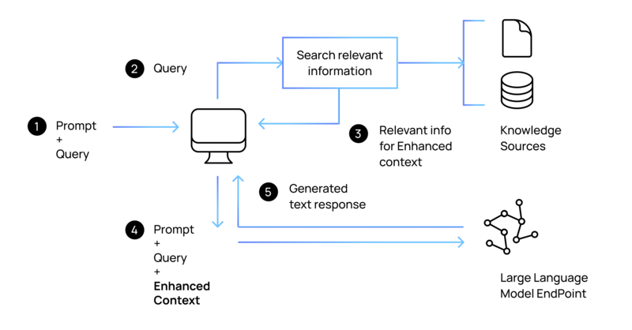

Credits: [EagerWorks](https://eagerworks.com/blog/retrieval-augmented-generation)

### Document Reading with PyPDF:
The project utilizes the pyPDF library to read and extract data from The Gale Encyclopedia of Medicine. This library efficiently handles large documents, facilitating the structured extraction of valuable medical information.

```python
def load_pdf(data):
    loader = DirectoryLoader(data,
                    glob="*.pdf",
                    loader_cls=PyPDFLoader)
    
    documents = loader.load()

    return documents

```

### Data Chunking:
After extracting the data, it is crucial to divide the information into manageable chunks. Chunking helps to:

- Improve retrieval efficiency by enabling quick access to relevant sections.

- Enhance context provided in responses, allowing the model to generate more meaningful answers.

- Mitigate issues related to the maximum token limits of language models by ensuring that only concise and relevant information is processed at any given time.

We also use overlap to keep in the context of these chunks

```python
def text_split(extracted_data):
    text_splitter = RecursiveCharacterTextSplitter(chunk_size = 500, chunk_overlap = 20)
    text_chunks = text_splitter.split_documents(extracted_data)

    return text_chunks
```

### Creating Semantic Embeddings:

- To facilitate meaningful queries and responses, we employ the HuggingFaceEmbeddings model (sentence-transformers/all-MiniLM-L6-v2).

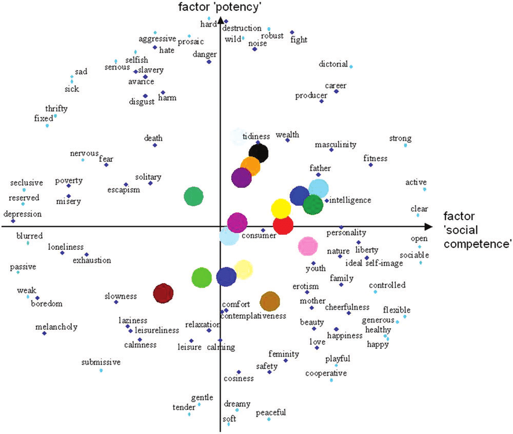
Credits: [Hugging Face](https://discuss.huggingface.co/t/get-word-embeddings-from-transformer-model/6929)

- This model generates semantic embeddings, which capture the context and meaning of the text beyond surface-level words.  These embeddings enable GaleMed to comprehend user queries more effectively and retrieve the most relevant information.

```python

def download_hugging_face_embeddings():
    embeddings = HuggingFaceEmbeddings(model_name="sentence-transformers/all-MiniLM-L6-v2")
    return embeddings

```

### Building a Vector Database with Pinecone:


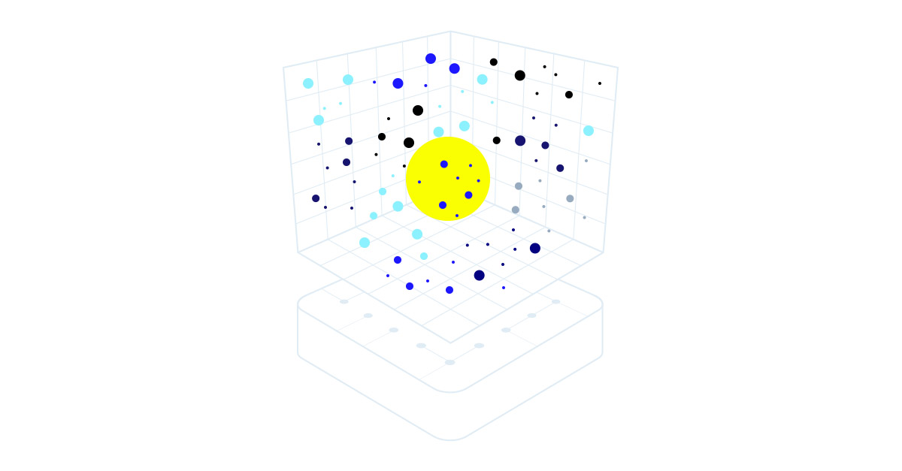
Credits:[Pinecone](https://www.pinecone.io/)

- The next step involves creating a vector database using Pinecone. 

- Then we load the chunked and embedded data into Pinecone, establishing a knowledge base that can efficiently manage user queries by identifying similar vectors and retrieving pertinent information.

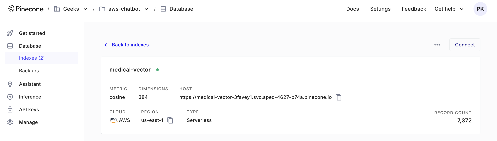

```python
#Initializing index name and the Pinecone

os.environ["PINECONE_API_KEY"] = "Your-Pinecone-API-Key"

index_name="medical-vector"

# Initialize Pinecone with optional parameters
try:
    pc = Pinecone(
        api_key=os.environ.get("PINECONE_API_KEY"),
        proxy_url=None,            # Example optional parameter
        proxy_headers=None,        # Example optional parameter
        ssl_ca_certs=None,        # Example optional parameter
        ssl_verify=True,  # Example optional parameter, usually set to True
    )
    
    # Check if the index exists
    indexes = pc.list_indexes()  # List of index names
    index_names = indexes.names()  # Get only the names of the indexes

    if index_name not in index_names:
        print(f'{index_name} does not exist')
        # Change the following line to create the index of your choice
        pc.create_index(
             name=index_name,
             dimension=384,
             metric="cosine",
             spec=ServerlessSpec(
                 cloud="aws",
                 region="us-east-1"
             )
         )
    else:
        print(f'{index_name} exists.')

    # Connect to the existing index
    index = pc.Index(index_name)

except Exception as e:
    print(f"An error occurred while checking indexes: {e}")

# Embedding the text chunks and storing them in Pinecone
try:
    docsearch = LangchainPinecone.from_texts(
        texts=[t.page_content for t in text_chunks],  # Assuming `text_chunks` is a list of text splits
        embedding=embeddings,  # Embedding model instance
        index_name=index_name
    )
except Exception as e:
    print(f"An error occurred while creating embeddings: {e}")

```

### Testing Queries:
Once the knowledge base is established, we conduct test queries to evaluate the performance of GaleMed. This testing phase ensures that the chatbot retrieves accurate and relevant information effectively, confirming the effectiveness of the RAG approach.

As you can see it does fetch relevant information for the first three except the fourth which we will handle as well

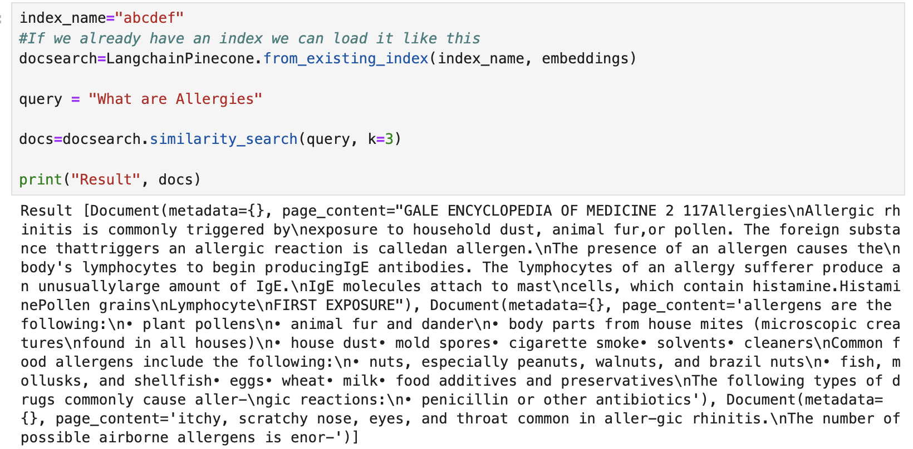
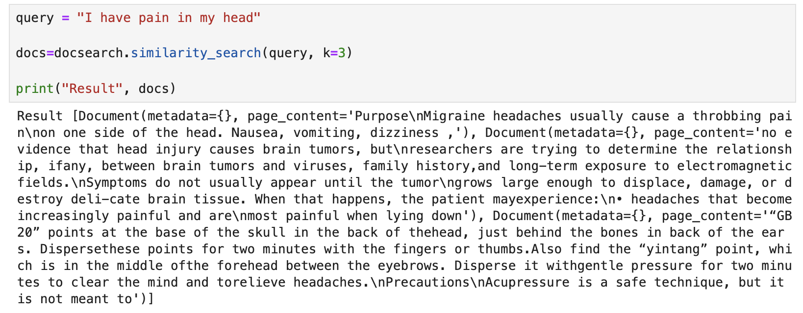
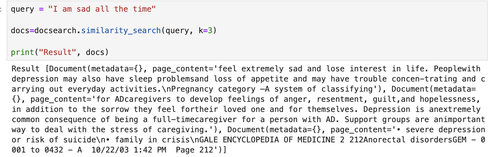
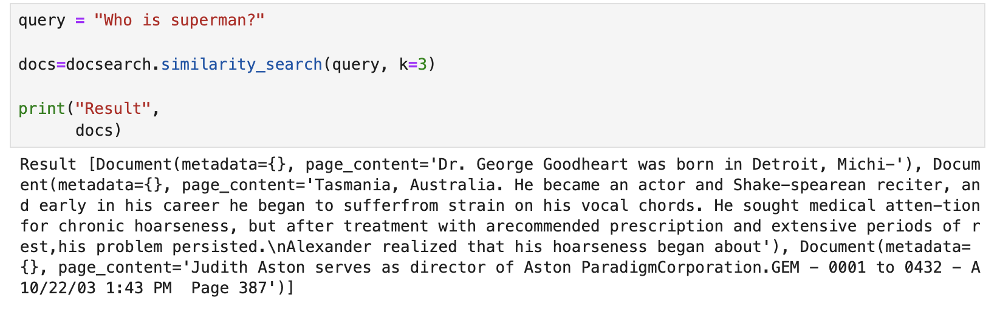


### Utilizing LLM for Response Formatting:

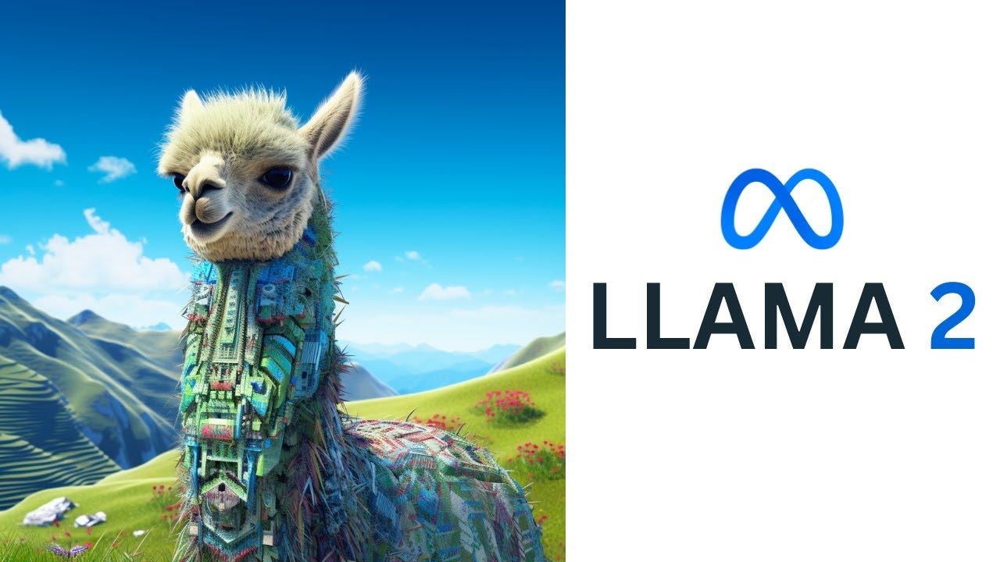

Credits: [Medium](https://medium.com/@dmitri.mahayana/creating-virtual-assistance-using-with-llama-2-7b-chat-model-9f693c8250ee)

To enhance the clarity and readability of the information returned to users, we utilize a large language model (LLM) based on the LLaMA architecture (CTransformers). This offline version processes the extracted data and formats it into coherent responses, making complex medical information accessible and understandable.

- First we use an offline model [Llama-2-7b](https://huggingface.co/TheBloke/Llama-2-7B-Chat-GGML)

- We then realised it takes a lot of time for us to get a response from these LLMs since not everyone usually have dedicated GPUs that these LLMs require
- Thus, it would be better to use LLM API
- For that we use any LLM Api but we went ahead and used the one at Groq
- We utilized **llama3-groq-70b-8192-tool-use-preview**
- The results were quick and effective
- The response for "I have pain in my head" was

LLM output:
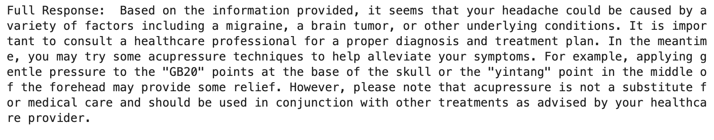

- It also ensure that it gives us a response only from the Gale Encylopedia mentioning "GB20" and the "yintang" points as well

Content from the book:
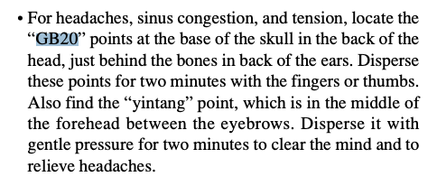

Compared to ChatGPT Response:
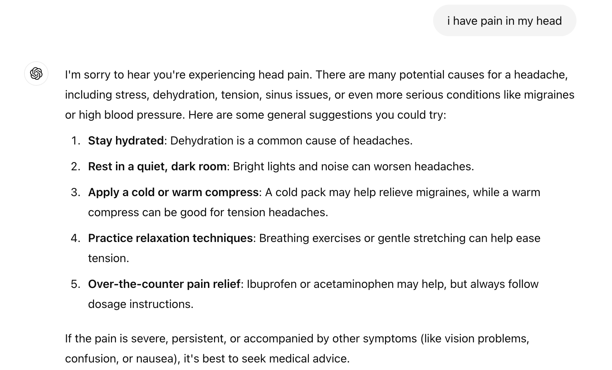

- Clearly our model with the Gale Encylopedia offers key inferences we wouldn't have gotten from general LLM models like ChatGPT

- Further we also handled cases where the query and the results got from the vector DB are not relevant.

### Flask Application Development:


Credits: [Flask](https://flask.palletsprojects.com/en/3.0.x/)

Finally, we aim to develop a Flask web application that serves as the interface for GaleMed. This application will allow users to interact with the chatbot seamlessly, posing questions and receiving comprehensive answers based on the medical encyclopedia.

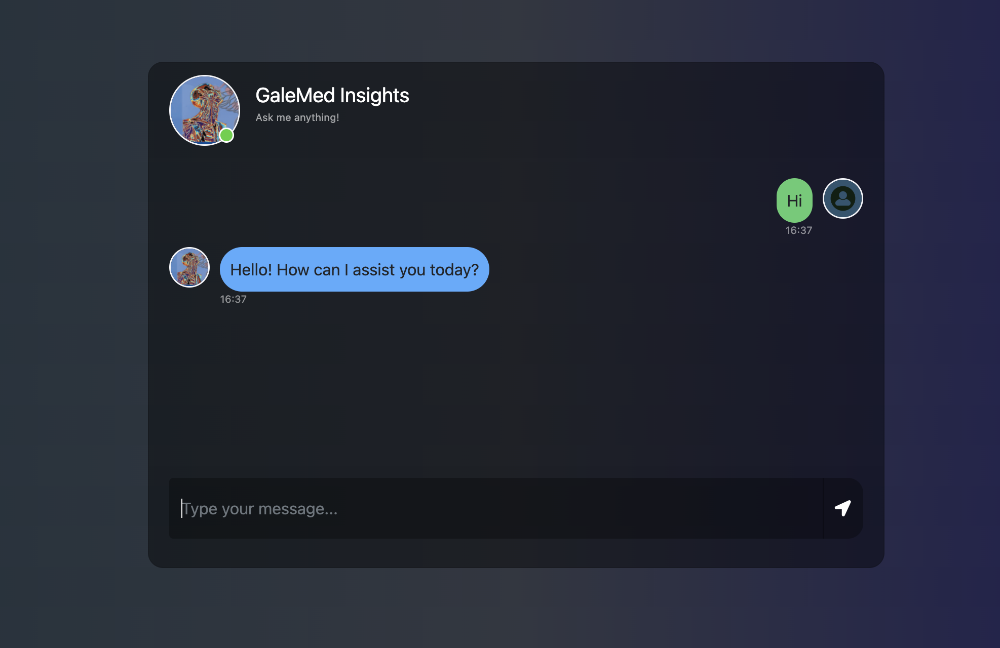
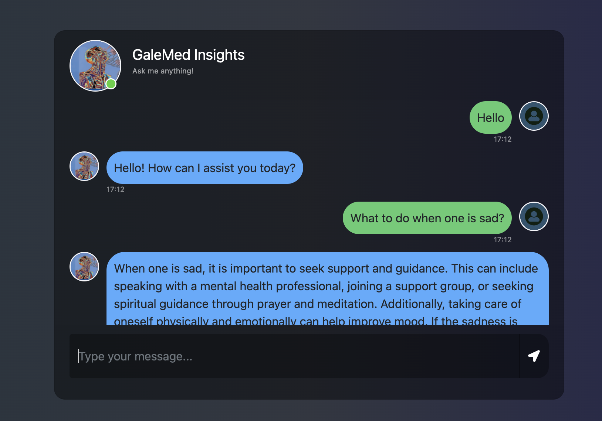
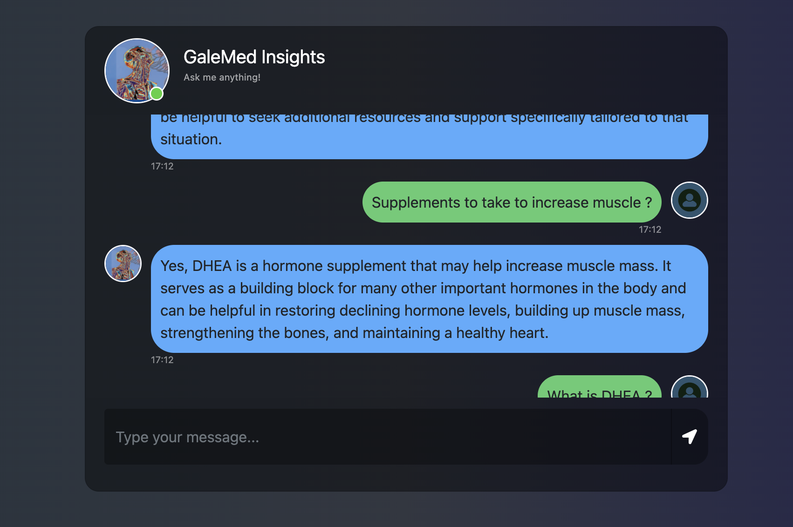
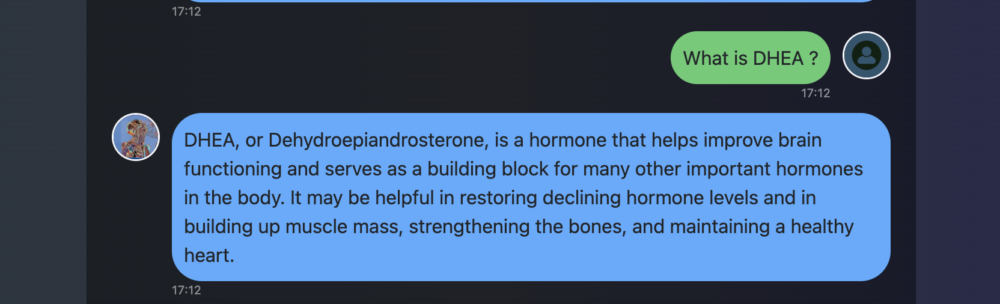
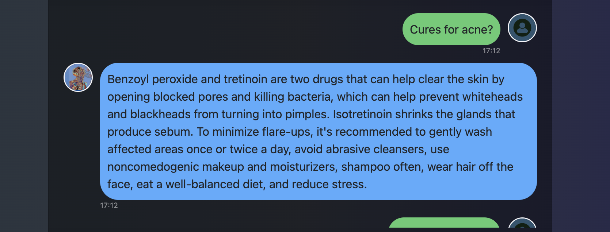
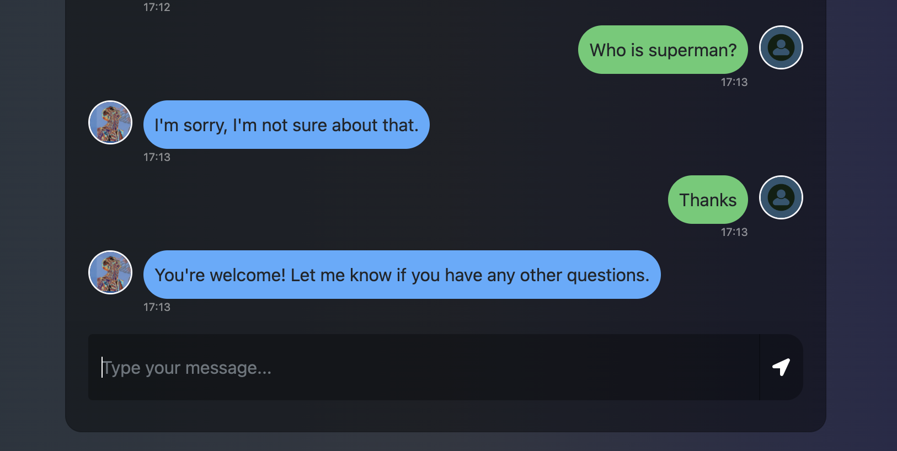


---
## Real-World Use Cases of RAG Methodology in Other Fields
This RAG-based approach is not only useful in healthcare but also has real-world applications in various fields, such as:

#### Legal Industry:
Legal research chatbots can use RAG to pull up relevant laws, precedents, and case summaries from specific legal databases, providing accurate and contextual legal advice.

#### Customer Support:
Companies can use RAG to power customer service bots that retrieve relevant product information and troubleshooting steps from their internal knowledge bases, enhancing customer experience with quicker and more accurate responses.

#### Education:
RAG-based educational bots can assist students by providing targeted explanations and detailed answers based on textbooks, enhancing their learning experiences.

#### Technical Documentation:
Tech companies can use RAG to help engineers and developers quickly retrieve information from large technical manuals or knowledge bases to solve problems efficiently.

---

By using a RAG framework such as GaleMed Insights, we can enable and ensure that users get precise, relevant information from a trusted source, improving the overall accuracy and reliability of responses across various industries.


# How to run?
### STEPS:

Clone the repository

```bash
Project repo: https://github.com/pramodkondur/GaleMed-Insights-GenAI-RAG
```
### STEP 01- Create a conda environment after opening the repository

```bash
conda create -n medicalbot python=3.11 -y
```

```bash
conda activate medicalbot
```


### STEP 02- install the requirements
```bash
pip install -r requirements.txt
```


### STEP 03 - APIs
Create Pinecone, Groq account and API

https://www.pinecone.io

https://groq.com

### STEP 04 - Create a `.env` file 

Create a '.env; file in the root directory and add your Pinecone & openai credentials as follows:

```ini
PINECONE_API_KEY = "xxxxxxxxxxxxxxxxxxxxxxxxxxxxx"
OPENAI_API_KEY = "xxxxxxxxxxxxxxxxxxxxxxxxxxxxx"
```

### STEP 05 - Run the function to store values into the Pincecone DB

```bash
# run the following command to store embeddings to pinecone
python store_index.py
```
### STEP 06 - Run the Flask App

```bash
# Finally run the following command
python app.py
```

Now,
```bash
open up localhost:
```


